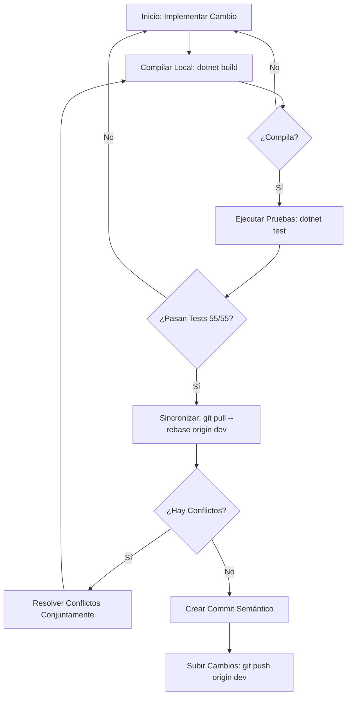

# 👥 Guía de Colaboración Git y Flujo de Trabajo en Equipo

Esta guía detalla el protocolo de ingeniería y flujo de trabajo para que **Thiago y Exequiel** colaboren de manera sincronizada y continua sobre la rama `dev`, preservando la estabilidad del código base y gestionando la promoción formal hacia la rama de producción (`prod`) para la evaluación de la cátedra de Desarrollo de Software (UTN - FRCU).

---

## 1. Dinámica de Trabajo en la Rama `dev`

Trabajar sobre una misma rama compartida de integración (`dev`) requiere una disciplina estricta de sincronización y pruebas previas para evitar regresiones o colisiones en la base de código.

### El Ciclo de Vida del Commit Seguro

Antes de subir cualquier cambio al repositorio remoto, cada desarrollador debe cumplir el siguiente flujo de validación local:



### Protocolo de Resolución de Conflictos entre Pares
Cuando se ejecuta `git pull --rebase` y surgen conflictos entre ramas locales y remotas:
1. **Analizar la Intención Técnica**: Revisar el historial de commits recientes (`git log -n 5`) para comprender el propósito del cambio introducido por el compañero de equipo.
2. **Fusión Lógica y Respeto de Reglas de Negocio**: No recurrir a resoluciones ciegas (`ours` o `theirs`). Fusionar conscientemente ambos bloques manteniendo la arquitectura DDD, contratos e integridad funcional.
3. **Validación Inmediata de Compilación y Tests**: Recompilar inmediatamente la solución (`dotnet build`) y ejecutar la suite completa de pruebas (`dotnet test`) antes de marcar como resuelto con `git rebase --continue`.

---

## 2. Configuración y Protección de la Rama `prod`

La rama `prod` representa el estado entregable del software y debe mantenerse estrictamente protegida para garantizar que el código entregado a la cátedra cumpla con los estándares académicos y no sufra modificaciones accidentales directas.

### A) Configuración de Reglas de Protección en GitHub
Para garantizar la gobernanza del repositorio (`ThiagoJGK/DesarrolloSoftwareGomezKehler`):

1. Acceder al repositorio en GitHub.
2. Ingresar en **Settings** (Configuración) > **Branches** (Ramas).
3. En la sección *Branch protection rules*, hacer clic en **Add branch protection rule**.
4. En **Branch name pattern**, ingresar `prod`.
5. Activar las directivas esenciales:
   * **Require a pull request before merging**: Exige que toda integración provenga de un Pull Request originado en `dev`.
   * **Require approvals**: Configura la aprobación obligatoria entre pares (Thiago o Exequiel) antes de autorizar el merge.
   * **Require status checks to pass before merging**: Exige que las validaciones de integración continua (CI) aprueben la suite de pruebas unitarias.
   * **Restrict who can push to matching branches**: Bloquea el `git push` directo sobre `prod`, garantizando que únicamente fusiones validadas lleguen a producción.
6. Guardar los cambios con **Save changes**.

---

## 3. Procedimiento de Promoción e Integración hacia `prod`

Cuando el conjunto de funcionalidades, persistencia y módulos de frontend de un hito o entrega se encuentra finalizado y estabilizado en `dev`, se procede a la apertura formal de un Pull Request de entrega:

### Checklist Previo a la Apertura del Pull Request
1. **Compilación Backend**:
   ```powershell
   dotnet build aspnet-core/TourismTracking.sln
   ```
2. **Suite de Pruebas Unitarias e Integración**:
   ```powershell
   dotnet test aspnet-core/TourismTracking.sln
   ```
   *Criterio:* Los 55 tests deben resultar exitosos (`Passed: 55, Failed: 0, Skipped: 0`).
3. **Compilación Frontend (Angular)**:
   ```powershell
   cd angular
   npm run build
   ```
   *Criterio:* Empaquetado exitoso sin errores de TypeScript ni discrepancias de tipado de proxies.

### Preparación del Pull Request Académico
1. Crear la rama `prod` si es la primera versión entregable o actualizarla con la base remota.
2. Abrir el Pull Request en GitHub desde `dev` hacia `prod`.
3. Estructurar el cuerpo del Pull Request con el estándar académico formal:
   * **Título:** Convención semántica (ej. `release: entrega trabajo práctico final - wanderTrack v1.0`).
   * **Resumen Ejecutivo:** Propósito del entregable y arquitectura implementada (DDD, ABP Framework v8.3.4, Angular 18).
   * **Matriz de Requerimientos Cátedra:** Mapeo detallado de RF 1 a RF 8 con verificación de cumplimiento.
   * **Evidencia de Pruebas:** Registro y log de ejecución de la suite de 55 pruebas unitarias.
   * **Credenciales Demo:** Detalle del usuario administrador (`admin` / `1q2w3E*`) y datos sembrados.
4. Realizar la revisión de código cruzada (Code Review) entre Thiago y Exequiel y concretar la fusión mediante merge formal.

---

## 4. Estándar de Mensajes de Commit (Conventional Commits)

Tanto Thiago como Exequiel deben mantener un historial de control de versiones ordenado, legible y profesional utilizando commits semánticos:

* `feat(...)`: Nueva funcionalidad de negocio o UI (ej. `feat(seeding): sembrar destinos y reseñas reales con fotos`).
* `fix(...)`: Corrección de un defecto o ajuste de comportamiento (ej. `fix(filters): corregir reactividad del acordeon de filtros`).
* `docs(...)`: Incorporación o actualización de documentación técnica y manuales (ej. `docs(git): formalizar guia de colaboracion en equipo`).
* `style(...)`: Formateo, estilos CSS/SCSS o limpieza visual sin alteración de lógica (ej. `style(branding): unificar isotipo de brujula y paleta institucional`).
* `refactor(...)`: Reestructuración interna de código sin alterar contratos ni agregar funcionalidades (ej. `refactor(domain): optimizar calculo de rating promedio en entidad Destination`).
* `test(...)`: Incorporación, ampliación o ajuste de pruebas unitarias (ej. `test(interaction): agregar pruebas de cobertura para resenas y favoritos`).
