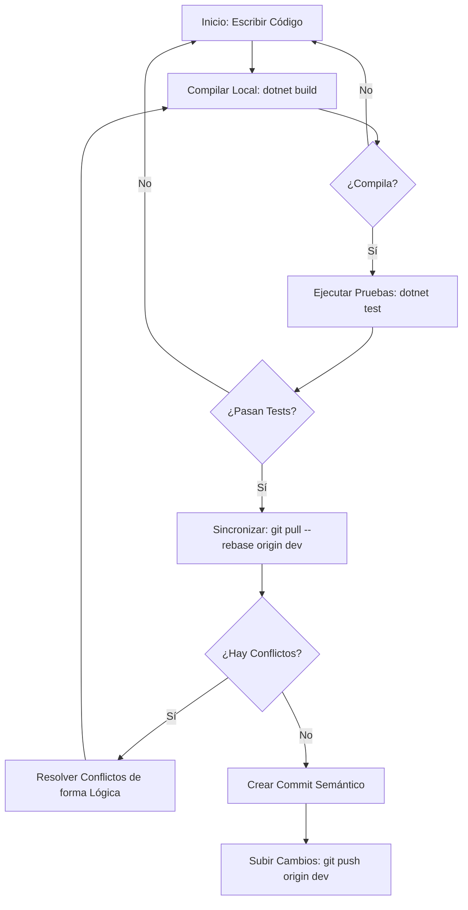

# 👥 Guía de Colaboración Git & Inteligencia Artificial

Esta guía detalla el flujo de trabajo para que **Thiago y Exequiel**, junto con sus respectivas instancias de **Antigravity**, colaboren dinámicamente sobre la rama `dev` sin pisarse el código, y cómo asegurar y delegar la integración hacia la rama de producción (`prod`).

---

## 1. Dinámica de Trabajo Dinámico en la Rama `dev`

Trabajar sobre una misma rama `dev` de manera dinámica requiere que las IAs sigan una disciplina estricta de sincronización para evitar conflictos destructivos.

### El Ciclo de Vida del Commit Seguro (IAs y Humanos)

Cada vez que tú o Exequiel le pidan a su IA realizar un cambio, la IA debe ejecutar el siguiente ciclo antes de subir cualquier código:

### Protocolo de Resolución de Conflictos para la IA
Cuando la IA hace `git pull --rebase` y encuentra conflictos, debe:
1. **Analizar la Intención**: Leer el historial de Git (`git log -n 5`) para entender qué estaba intentando hacer el colaborador en las líneas en conflicto.
2. **Fusión Lógica, No Ciega**: No debe descartar los cambios del colaborador (`ours` o `theirs` a ciegas). Debe fusionar ambos bloques manteniendo la coherencia funcional del sistema.
3. **Validación Inmediata**: Re-compilar y ejecutar las pruebas inmediatamente para asegurar que la resolución del conflicto no rompió la aplicación.

---

## 2. Configuración y Protección de la Rama `prod`

La rama `prod` representa el estado entregable del software y debe estar protegida para evitar errores humanos o de la IA que puedan romper el código listo para la entrega de la cátedra.

### A) Cómo configurar la Protección de Ramas en GitHub (Paso a Paso)
Como desarrollador humano, debes configurar esto en la interfaz web de tu repositorio de GitHub:

1. Ve a tu repositorio en GitHub (`ThiagoJGK/DesarrolloSoftwareGomezKehler`).
2. Haz clic en la pestaña **Settings** (Configuración) en la barra superior.
3. En el menú lateral izquierdo, haz clic en **Branches** (Ramas).
4. En la sección *Branch protection rules*, haz clic en **Add branch protection rule** (Añadir regla de protección de rama).
5. En **Branch name pattern**, escribe `prod`.
6. Activa las siguientes opciones clave:
   *   **Require a pull request before merging**: Fuerza a que todo cambio a `prod` deba pasar por un Pull Request (PR) desde `dev`.
       *   *Opcional*: **Require approvals**: Puedes exigir que Exequiel apruebe tu PR (o viceversa) antes del merge.
   *   **Require status checks to pass before merging**: Si configuran GitHub Actions, exige que la compilación y pruebas pasen en la nube antes de fusionar.
   *   **Restrict who can push to matching branches**: Evita que se pueda hacer un `git push origin prod` directo, incluso desde la terminal de los administradores.
7. Haz clic en **Save changes**.

---

## 3. Cómo Delegar la Integración a `prod` a la IA

¡Puedes delegar completamente la preparación de la entrega a tu agente Antigravity! Gracias a que cuenta con el conector de GitHub, Antigravity puede gestionar el ciclo de integración de la siguiente manera:

### Tarea de la IA: Crear y Validar el Pull Request a `prod`
Cuando decidan que un conjunto de funcionalidades en `dev` está listo para ser promovido a producción:

1. **Prompt para la IA (Tú le dices esto):**
   > *"Antigravity, valida que la rama dev compile y pase todas las pruebas locales. Si todo es correcto, crea un Pull Request desde la rama dev hacia la rama prod con un resumen técnico detallado de los cambios de cara a la cátedra."*

2. **Acción de la IA:**
   *   El agente ejecuta `git checkout dev` y realiza un `git pull`.
   *   Ejecuta `dotnet build` y `dotnet test`.
   *   Si todo pasa, utiliza su herramienta de GitHub (`create_pull_request`) para crear un PR limpio desde `dev` a `prod`.
   *   Redactará un cuerpo del PR con formato profesional (ej. Changelog, evidencias de pruebas, y alineación con los requerimientos).

3. **Acción del Desarrollador (Humano):**
   *   Tú o Exequiel entran a GitHub, revisan el Pull Request creado por el agente, verifican que no haya conflictos visuales, y hacen clic en **Merge Pull Request** para enviarlo a `prod`.

---

## 4. Estándar de Mensajes de Commit (Conventional Commits)

Tanto tú, Exequiel, como las IAs deben utilizar commits semánticos para mantener el historial ordenado:

*   `feat(...)`: Nueva funcionalidad (ej. `feat(rating): add 1-5 star review endpoint`).
*   `fix(...)`: Resolución de un bug (ej. `fix(destinations): fix null population handler from OpenMeteo`).
*   `docs(...)`: Cambios únicamente en documentación (ej. `docs(readme): update onboarding instructions`).
*   `style(...)`: Cambios de formato o estilo que no afectan la lógica (ej. `style(angular): run prettier on user profile component`).
*   `refactor(...)`: Reestructuración de código que no añade features ni arregla bugs (ej. `refactor(domain): update experience aggregate roots`).
*   `test(...)`: Añadir o modificar pruebas (ej. `test(application): add unit tests for review average`).
