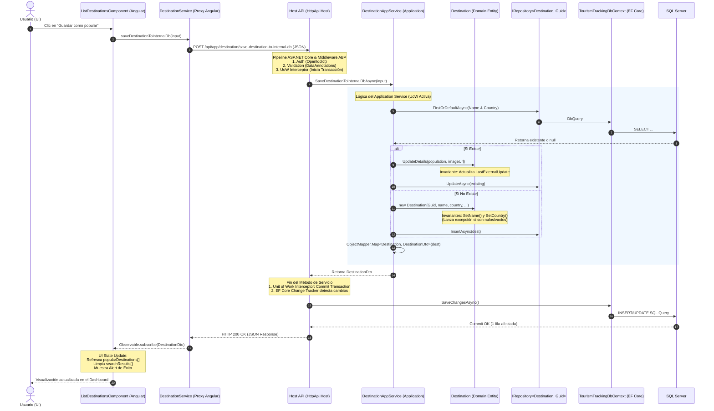
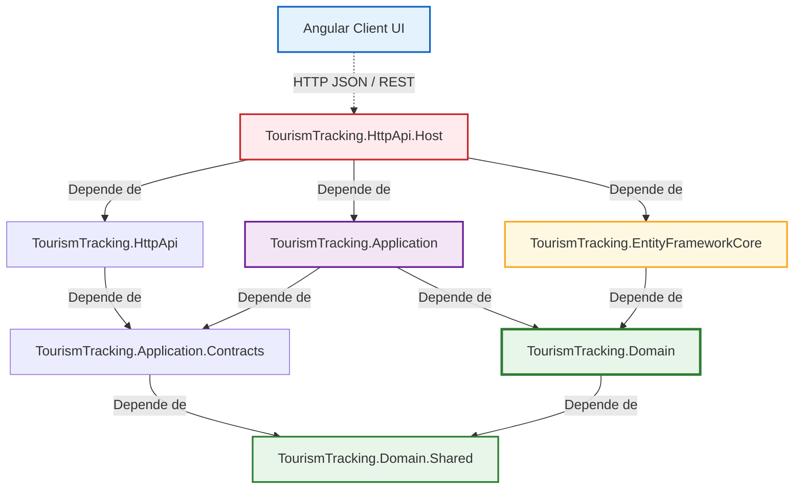

# 📐 Análisis Arquitectónico y Justificación Técnica: TourismTracking
**Para uso en la Presentación y Defensa Académica del Proyecto Final (Año 2025)**

Este documento expone de manera formal la arquitectura del software de **TourismTracking**, justificando técnicamente las decisiones de diseño adoptadas (DDD, ABP.IO, Angular, EF Core) y detallando el flujo de datos extremo a extremo para el tribunal examinador.

---

## 1. Mapeo del Flujo de Datos Extremo a Extremo (Data Flow)

Para ilustrar de forma clara cómo viajan los datos en el sistema, analizamos el caso de uso real de **Guardar un Destino Popular** en la base de datos interna (`SaveDestinationToInternalDbAsync`). El flujo recorre desde la interacción visual hasta la persistencia física en SQL Server y el posterior refresco de la UI en Angular.



### Explicación Técnica Detallada del Flujo de Datos

#### 1. Capa de Presentación (Angular UI Component)
*   **Componente (`ListDestinationsComponent`):** El usuario interactúa con la pantalla (`list-destinations.component.html`) y presiona el botón "Guardar". El componente captura el evento mediante el método `saveDestination(dest)`.
*   **Servicio Proxy (`DestinationService`):** Invoca a `this.destinationService.saveDestinationToInternalDb(...)`. Este archivo (`destination.service.ts`) no fue escrito a mano; es generado automáticamente por el CLI de ABP mediante `abp generate-proxy`. Utiliza el servicio `@abp/ng.core` (`RestService`) para realizar una petición HTTP estructurada, garantizando **tipado estricto** 1:1 entre el frontend en TypeScript y los DTOs definidos en C# en el backend.

#### 2. Capa de Red y Host API (ASP.NET Core Web API Host)
*   La petición `POST` serializada en JSON llega al proyecto ejecutable `TourismTracking.HttpApi.Host`.
*   **Dynamic Web API (Conventional Controllers):** En el archivo `TourismTrackingHttpApiHostModule.cs`, ABP configura controladores convencionales a través de `options.ConventionalControllers.Create(typeof(TourismTrackingApplicationModule).Assembly)`. Esto significa que **no existen controladores físicos repetitivos** en el backend. El framework intercepta la ruta `/api/app/destination/save-destination-to-internal-db` y la asocia directamente al método de C# `DestinationAppService.SaveDestinationToInternalDbAsync` utilizando reflexiones en tiempo de compilación/ejecución.

#### 3. Interceptores de ABP (Filtros y Middleware de Infraestructura)
Antes de que el código del servicio de aplicación comience a ejecutarse, ABP inyecta de forma transparente varios aspectos (AOP):
*   **Autenticación y Autorización:** Se evalúan los tokens JWT emitidos por el módulo de **OpenIddict** integrado en el Host.
*   **Validación de Modelos:** El validador automático analiza las propiedades de `SaveDestinationInput`. Si, por ejemplo, el nombre viene vacío o el formato de las coordenadas es inválido, ABP aborta inmediatamente la petición y genera un HTTP 400 Bad Request estructurado con los detalles de validación, sin necesidad de escribir validaciones manuales `if (!ModelState.IsValid)` en el backend.
*   **Unit of Work (Unidad de Trabajo):** El interceptor `UnitOfWorkInterceptor` de ABP detecta que se ingresa a un servicio de aplicación y **abre una transacción de base de datos** automáticamente.

#### 4. Capa de Aplicación (Application Service)
*   **`DestinationAppService`:** Coordina la operación. Inyecta el repositorio genérico `IRepository<Destination, Guid>` y la factoría `IHttpClientFactory` para la integración de servicios de terceros (como la API de geocodificación externa Open-Meteo).
*   **Consulta previa:** Se realiza un chequeo interno: `_destinationRepository.FirstOrDefaultAsync(d => d.Name == input.Name && d.Country == input.Country)`.
*   **Mapeo DTO a Entidad / Mutación:**
    *   Si el destino ya se encuentra registrado, se invoca el método de comportamiento de dominio `existing.UpdateDetails(...)`. EF Core adjunta automáticamente esta entidad a su Change Tracker en estado modificado.
    *   Si es un destino nuevo, se instancia la entidad de dominio `Destination` pasando los parámetros a su constructor y usando el generador secuencial de IDs de ABP (`GuidGenerator.Create()`) que optimiza los índices agrupados de la base de datos SQL Server.
*   El servicio convierte la entidad resultante a un DTO (`DestinationDto`) usando `ObjectMapper.Map`, abstrayendo la inicialización de propiedades complejas mediante perfiles de **AutoMapper**.

#### 5. Capa de Dominio (Domain Entity & Invariants Validation)
*   La clase `Destination` hereda de `FullAuditedAggregateRoot<Guid>`.
*   **Protección de Invariantes:** Las propiedades tienen setters privados (`private set`), lo que impide que agentes externos corrompan el estado del objeto. Toda mutación se efectúa mediante métodos explícitos (`UpdateDetails`, `SetName`, `SetCountry`).
*   Los métodos de validación internos (`SetName` y `SetCountry`) lanzan un `ArgumentException` si se intentan ingresar datos incoherentes o vacíos. Esto asegura que **la entidad de dominio sea la única responsable de garantizar su propia validez**, respetando las mejores prácticas de DDD.

#### 6. Capa de Infraestructura / Persistencia (EF Core, Repositories y Unit of Work Commit)
*   El repositorio `IRepository<Destination, Guid>` actúa como una abstracción en memoria de la colección de entidades. Las llamadas a `InsertAsync` o `UpdateAsync` interactúan con el `DbContext` subyacente.
*   Al salir exitosamente del método `SaveDestinationToInternalDbAsync`, el interceptor de la **Unit of Work** toma el control:
    *   Llama internamente a `SaveChangesAsync()` en `TourismTrackingDbContext`.
    *   El **Change Tracker** de EF Core genera las sentencias SQL necesarias (`INSERT` o `UPDATE`).
    *   Dado que `Destination` implementa `FullAuditedAggregateRoot`, ABP intercepta el guardado y **autocompleta automáticamente** las propiedades de auditoría (quién creó/modificó el registro, en qué fecha y hora UTC, etc.), además de manejar el borrado lógico (*Soft Delete* mediante la columna `IsDeleted`).
    *   La transacción se confirma en la base de datos SQL Server. Si ocurre cualquier error inesperado en este punto, la transacción se revierte por completo (*Rollback*).

#### 7. Retorno del Flujo a la UI
*   El DTO mapeado se serializa automáticamente a JSON y se envía con un código de estado HTTP 200 OK.
*   El frontend en Angular captura la respuesta mediante la suscripción del Observable en `list-destinations.component.ts`. Se actualiza el estado local (`this.popularDestinations = res`), refrescando automáticamente la vista HTML gracias al sistema de detección de cambios de Angular, y se despliega una alerta amigable al usuario.

---

## 2. Justificación Técnica: ¿Por qué ABP.IO y DDD en este Proyecto?

La combinación de **DDD** como paradigma de diseño y **ABP.IO** como framework de desarrollo de aplicaciones empresariales se justifica en base a los siguientes pilares de ingeniería de software:

### A. Justificación del uso de DDD (Domain-Driven Design)

1.  **Modelo de Dominio Rico vs Modelo de Dominio Anémico:**
    *   En las arquitecturas tradicionales orientadas a datos (tablas y scripts de transacción), las entidades son meras bolsas de datos con getters y setters públicos (`Anemic Model`), esparciendo la lógica de negocio por múltiples controladores o servicios.
    *   En este proyecto, clases como `Destination`, `Experience` y `Review` (declaradas en `TourismTracking.Domain`) encapsulan sus reglas de negocio. Por ejemplo, en `Review`, el método `SetRating` impide estrictamente guardar calificaciones fuera del rango de 1 a 5 estrellas:
        ```csharp
        private void SetRating(int rating)
        {
            if (rating < 1 || rating > 5) 
                throw new ArgumentOutOfRangeException(nameof(rating), "Rating must be between 1 and 5.");
            Rating = rating;
        }
        ```
        Esto garantiza que las reglas críticas del negocio se evalúen centralizadamente en el corazón del sistema, y no de forma duplicada e inconsistente en el frontend o en la capa API.
2.  **Límite de Agregados (Aggregate Roots & Boundaries):**
    *   El diseño define agregados claros como `Destination` y `Experience` que heredan de `FullAuditedAggregateRoot<Guid>`. Ellos actúan como las puertas de enlace para gestionar sus colecciones internas, manteniendo límites bien definidos que reducen el acoplamiento y facilitan la consistencia transaccional.
3.  **Independencia de la Tecnología (Separation of Concerns):**
    *   La capa de dominio no depende de la base de datos (SQL Server), ni de las APIs HTTP, ni de Angular. Es C# puro. Si en el futuro se decidiera migrar la persistencia de SQL Server a MongoDB o a CosmosDB, la lógica de negocio contenida en `TourismTracking.Domain` permanecería intacta.

### B. Justificación del uso de ABP.IO

1.  **Eliminación Drástica de Código Repetitivo (Boilerplate):**
    *   Crear desde cero un sistema que gestione usuarios, roles, permisos granulares, auditoría, sesiones concurrentes, configuración multitenant e integración OAuth2/OpenID Connect consumiría meses de desarrollo.
    *   ABP proporciona una arquitectura base robusta y lista para producción (Enterprise-Grade). En este proyecto universitario, esto permitió **enfocar el 100% del esfuerzo académico y de desarrollo en la lógica de valor** (seguimiento de destinos, reseñas de usuarios y experiencias de viaje) en lugar de reinventar la seguridad y el almacenamiento de credenciales.
2.  **Proxies API y Tipado Fuerte de Extremo a Extremo:**
    *   La sincronización manual de DTOs entre el backend y Angular es propensa a fallas ortográficas y de tipos de datos. Con el generador de proxies dinámico de ABP, el frontend se acopla de manera segura y transparente al contrato del backend, acelerando el desarrollo e impidiendo inconsistencias en las llamadas HTTP.
3.  **Convención sobre Configuración (Convention over Configuration):**
    *   Al llamar a `builder.ConfigureByConvention()` en el DbContext, EF Core sabe exactamente cómo mapear tablas, columnas, índices de auditoría y relaciones de Soft-Delete de manera uniforme para todas las entidades. Adicionalmente, el registro automático de inyección de dependencias (`ITransientDependency`, `ISingletonDependency`) ahorra cientos de líneas de configuración manual en el contenedor de servicios de ASP.NET Core.

---

## 3. Análisis de Dependencias e Interconexión de Módulos

La solución backend sigue una arquitectura de capas concéntrica bajo el enfoque de DDD. A continuación se detalla cómo fluyen las dependencias físicas (referencias entre proyectos) y cómo interviene el sistema modular descentralizado de ABP.

### Diagrama de Dependencias del Sistema



---

## 4. Resumen de Patrones y Buenas Prácticas Aplicadas

Para destacar en la defensa final del proyecto, se deben resaltar los siguientes patrones de diseño de software implementados activamente en la arquitectura:

| Patrón / Práctica | Ubicación en el Código de TourismTracking | Beneficio Técnico para el Proyecto |
| :--- | :--- | :--- |
| **Aggregate Root (Raíz de Agregado)** | Entidades `Destination` y `Experience` | Protege los límites de persistencia y encapsula invariantes críticas del negocio de viajes. |
| **Unit of Work (Unidad de Trabajo)** | Configurado implícitamente por ABP en `TourismTrackingHttpApiHostModule` (`app.UseUnitOfWork()`) | Garantiza la consistencia de transacciones en base de datos. Si falla un paso intermedio en la lógica de experiencias o favoritos, todo se revierte (*Rollback*). |
| **Generic Repository** | Inyección de `IRepository<Destination, Guid>` en `DestinationAppService` | Abstrayó la escritura de consultas SQL y operaciones CRUD repetitivas, reduciendo líneas de código de infraestructura a cero. |
| **Data Transfer Object (DTO)** | Clases `DestinationDto` y `SaveDestinationInput` en `Application.Contracts` | Evita la sobre-exposición de la estructura física de la base de datos hacia el exterior y ahorra ancho de banda de red. |
| **Separación de Responsabilidades (SoC)** | Estructura DDD de 4 capas + Cliente Frontend desacoplado | Garantiza alta mantenibilidad, modularidad y facilidad para realizar pruebas unitarias automatizadas sobre el Core. |
| **Auditoría Automática** | Herencia de `FullAuditedAggregateRoot<Guid>` | Completa de forma automática columnas críticas (`CreationTime`, `CreatorId`, `LastModificationTime`, `IsDeleted`) esenciales para la trazabilidad de datos en sistemas reales. |
