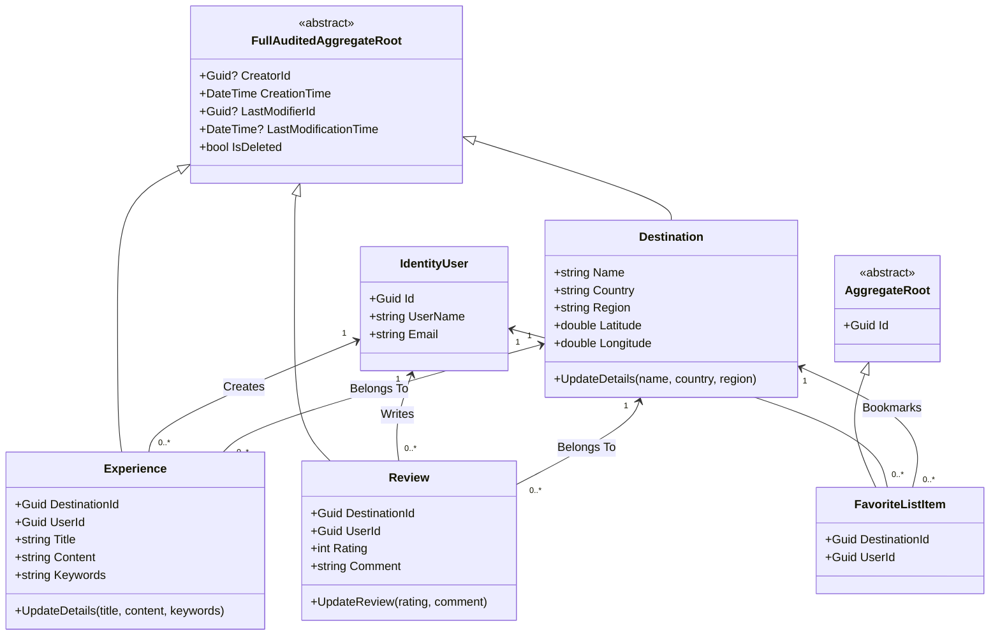
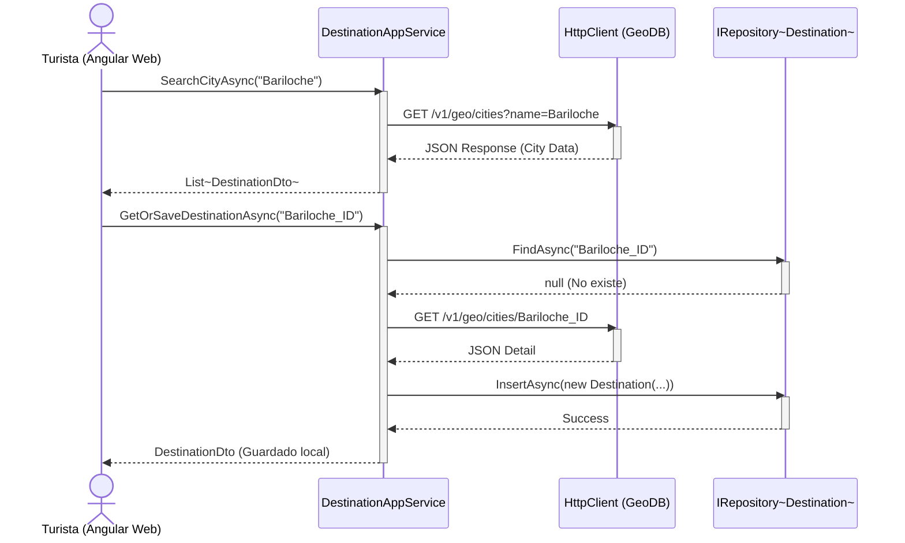
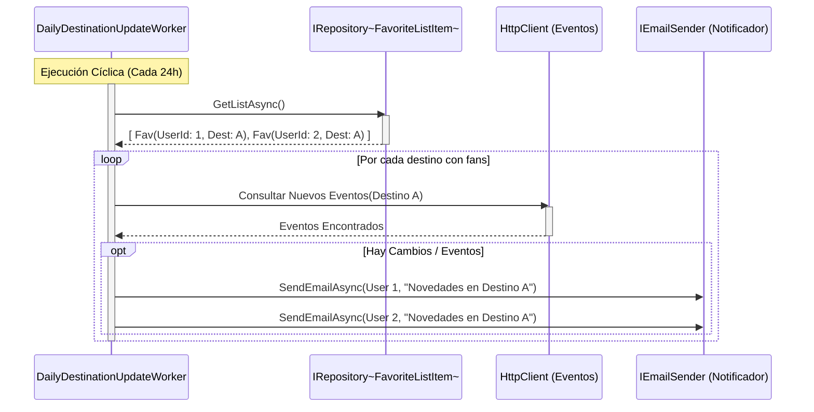

# Diagramas UML - Tourism Tracking Platform

A continuación se presentan los diagramas fundamentales que describen la arquitectura, el comportamiento y el modelo de dominio de la plataforma, listos para ser adjuntados en la entrega final de la materia.

## 1. Diagrama de Clases (Domain Model)

Muestra las entidades principales del dominio, sus propiedades (obligatorias por DDD) y las relaciones entre ellas.



---

## 2. Diagrama de Casos de Uso

Describe las interacciones de los distintos actores (Turista/Usuario y Administrador) con el sistema.

```mermaid
usecaseDiagram
    actor "Turista (Usuario Registrado)" as User
    actor "Administrador" as Admin
    
    package "Módulo de Destinos" {
        usecase "Buscar Destino (GeoDB)" as UC1
        usecase "Guardar Destino Internamente" as UC2
        usecase "Gestionar Favoritos" as UC3
    }
    
    package "Módulo de Interacción" {
        usecase "Publicar Experiencia" as UC4
        usecase "Calificar Destino (1-5)" as UC5
        usecase "Leer Promedio Público" as UC6
    }
    
    package "Módulo de Administración" {
        usecase "Ver Métricas Externas" as UC7
        usecase "Consultar Logs de Auditoría" as UC8
    }

    User --> UC1
    User --> UC2
    User --> UC3
    User --> UC4
    User --> UC5
    User --> UC6
    
    Admin --> UC7
    Admin --> UC8
    Admin --> UC6
    
    UC1 ..> UC2 : <<include>>
```

---

## 3. Diagrama de Secuencia: Búsqueda y Guardado de Destino

Ilustra el flujo arquitectónico en capas (Web -> AppService -> Repositorio/API) cuando un usuario busca y guarda una nueva ciudad.



---

## 4. Diagrama de Secuencia: Worker de Notificaciones Diarias

Muestra el proceso en segundo plano (Requisito 7) que cruza los Favoritos con Eventos Externos (TicketMaster).


