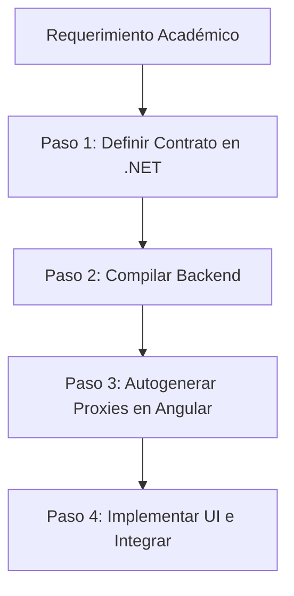

# 📐 Spec-Driven Development (SDD) en TourismTracking

Esta **Skill** describe el flujo de desarrollo obligatorio para agregar o modificar cualquier funcionalidad del sistema que involucre comunicación de datos entre el Backend y el Frontend. 

El objetivo de SDD en este proyecto es asegurar que **el contrato de datos sea la única fuente de verdad (Single Source of Truth)**. De esta forma, Thiago, Exequiel y las IAs pueden trabajar en paralelo sobre el Frontend y el Backend con la certeza matemática de que las interfaces calzarán perfectamente al integrarse.

---

## 🔄 1. El Flujo de Trabajo SDD en ABP.IO & Angular

Cuando se solicite implementar un requerimiento funcional (RF), la IA debe seguir estrictamente este flujo de 4 pasos:



### Paso 1: Definición del Contrato en Backend (C#)
Los contratos se definen exclusivamente en el proyecto `TourismTracking.Application.Contracts` para mantener el desacoplamiento de la lógica de negocio.

1.  **Definir los DTOs (Data Transfer Objects):** Crear las clases de entrada y salida necesarias en la carpeta del módulo correspondiente (ej. `Destinations/DestinationDto.cs`, `Destinations/SaveDestinationInput.cs`).
2.  **Definir la Interfaz del Servicio (`IAppService`):** Crear la interfaz que expone el endpoint heredando de `IApplicationService`.
    *   *Ejemplo:*
        ```csharp
        public interface IDestinationAppService : IApplicationService
        {
            Task<List<DestinationDto>> SearchExternalDestinationsAsync(string nameQuery);
            Task<DestinationDto> SaveDestinationToInternalDbAsync(SaveDestinationInput input);
        }
        ```

### Paso 2: Compilación de la Solución
Para que la CLI de ABP pueda leer los metadatos y la especificación del nuevo servicio, la solución .NET debe estar compilada localmente de forma limpia:
```powershell
dotnet build aspnet-core/TourismTracking.sln
```

### Paso 3: Generación Automática del Proxy en Angular
La IA tiene **estrictamente prohibido** escribir llamadas HTTP manuales en Angular (`HttpClient.get`, `HttpClient.post`) para comunicarse con nuestro backend. Se debe utilizar la autogeneración nativa de ABP:

1.  Abrir la consola en el directorio de `angular`.
2.  Ejecutar el comando de generación de proxies de ABP:
    ```powershell
    abp generate-proxy -t ng
    ```
3.  **Resultado Esperado:** La herramienta CLI de ABP leerá los endpoints de ASP.NET Core y generará automáticamente los archivos TypeScript correspondientes (servicios, DTOs y tipos) en `angular/src/app/proxy/`.

### Paso 4: Consumo e Implementación en Frontend (TypeScript)
En el componente Angular, inyectar el servicio generado y consumirlo de forma nativa tipada:
*   *Ejemplo:*
    ```typescript
    import { DestinationService } from '@proxy/destinations';
    
    constructor(private destinationService: DestinationService) {}
    
    buscarCiudades(query: string) {
      this.destinationService.searchExternalDestinations(query).subscribe(results => {
        this.destinos = results;
      });
    }
    ```

---

## 🛡️ 2. Trazabilidad Académica

Para facilitar la defensa oral y justificación de decisiones ante la cátedra, cada vez que la IA defina una interfaz de servicios de aplicación (Paso 1):

1.  **Cabecera de Trazabilidad:** Debe agregar una breve descripción de qué Requerimiento Funcional (RF) de la [Matriz de Operaciones del Sistema](file:///c:/Users/thiag/Desktop/Files/Facu/FACU%202024/Desarrollo%20de%20Software/Proyecto%20Final/Documentacion/Operaciones_Sistema_v1.0.md) está resolviendo este contrato.
2.  **Justificación de Diseño:** Justificar por qué las propiedades del DTO son de ciertos tipos, y documentar los flujos de datos en el Markdown de justificación técnica para la presentación.
